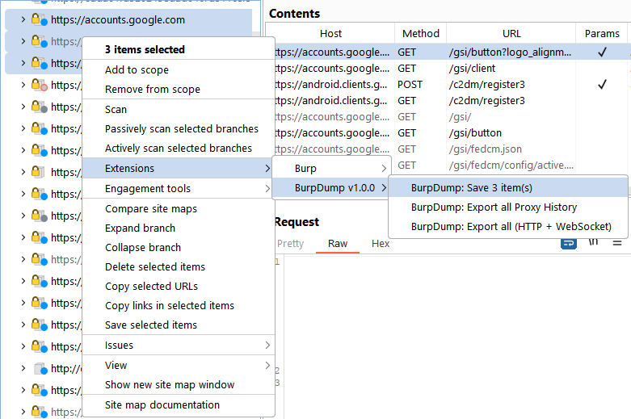

# BurpDump - Burp Suite Extension

Exports selected HTTP history items (and captured WebSocket frames) to the filesystem, preserving the URL path structure with second-level domain grouping.



Example of the resulting directory structure:
````
├───google.com
│   ├───accounts.google.com
│   │   │   index.request
│   │   │
│   │   ├───gsi
│   │   │   │   button.request
│   │   │   │   client
│   │   │   │   client.request
│   │   │   │   client.response
│   │   │   │   fedcm.json.request
│   │   │   │   index.request
│   │   │   │   log.request
│   │   │   │   revoke.request
│   │   │   │   select.request
│   │   │   │   status.request
│   │   │   │   style
│   │   │   │   style.request
│   │   │   │   style.response
│   │   │   │
│   │   │   ├───fedcm
│   │   │   │   └───config
│   │   │   │           active.json.request
│   │   │   │           passive.json.request
│   │   │   │
│   │   │   └───iframe
│   │   │           select.request
│   │   │
│   │   └───o
│   │       └───oauth2
│   │           │   iframe.request
│   │           │
│   │           └───v2
│   │                   auth.request
│   │
│   └───android.clients.google.com
│       │   index.request
│       │
│       └───c2dm
│               register3.(2)
│               register3.(2).request
│               register3.(2).request.data
│               register3.(2).response
│               register3.request
│
└───reddit.com
    └───alb.reddit.com
            i.gif.request
            track.(2)
            track.(2).request
            track.(2).request.data
            track.(2).response
````

## Output Format

### HTTP History

For each selected request the extension creates up to four files:

| File | Content |
|------|---------|
| `./{group}/{host}/{path}` | Response body (decompressed if gzip/deflate) |
| `./{group}/{host}/{path}.response` | Response headers |
| `./{group}/{host}/{path}.request` | Request headers |
| `./{group}/{host}/{path}.request.data` | Request body (only when present) |

### WebSocket History

Each WebSocket send/receive is a separate file:

| File | Content |
|------|---------|
| `./{group}/{host}/{path}#ws.{id}.send` | Client → server frame payload |
| `./{group}/{host}/{path}#ws.{id}.recv` | Server → client frame payload |

The `{id}` is `unix_timestamp × 1000 + unique_number` (unique within each second, up to 1000 messages/sec).

**Example:**

```
./my.com/api.my.com/socket#ws.1771006862000.send
./my.com/api.my.com/socket#ws.1771006862001.recv
./my.com/api.my.com/socket#ws.1771006862002.send
./my.com/api.my.com/socket#ws.1771006862003.send
./my.com/api.my.com/socket#ws.1771006862004.recv
./my.com/api.my.com/socket#ws.1771006863000.send
```

### Grouping

`{group}` is the second-level domain extracted from the hostname. This keeps all subdomains of a site in one directory:

| Hostname | Group |
|----------|-------|
| `accounts.google.com` | `google.com` |
| `android.clients.google.com` | `google.com` |
| `google.com` | `google.com` |
| `localhost` | `localhost` |
| `192.168.1.1` | `192.168.1.1` |

### Path handling

- `?` in the URL → `#`
- URL-encoded characters (`%20` etc.) → decoded to normal form
- Characters forbidden by the OS (`< > : " | * \`) → `_`
- Non-standard ports appended to the host: `example.com_8080`

### 304 Not Modified

Responses with status **304 Not Modified** are automatically skipped - they carry no useful content and would overwrite previously exported data.

### File timestamps

All created files have their **creation time** and **last-modified time** set to the time the request/response was sent/received (derived from the HTTP `Date` response header; falls back to the current time if the header is missing).

## Build

Requires JDK (`javac` and `jar` on PATH).

```
build.cmd [version]
```

The output JAR is placed in `build\BurpDump.jar`.  
If no version is given, it defaults to `dev`.

## Installation in Burp Suite

1. **Extender** → **Extensions** → **Add**
2. Extension type: **Java**
3. Select `build\BurpDump.jar` (or the JAR from [Releases](../../releases/latest))
4. Click **Next** - the extension loads and is ready to use.

## Usage

### HTTP History export

1. Open **HTTP History** (or any tab that shows request/response items).
2. Select one or more entries.
3. Right-click → **BurpDump: Save N item(s)…**
4. Choose a destination directory - a progress bar tracks the export.
5. Files are saved; a summary is shown when finished.

### WebSocket History export

The extension passively captures WebSocket connections detected via the Proxy / HTTP listener. When frames have been captured:

1. Right-click anywhere in Burp → **BurpDump: Export N WebSocket message(s)…**
2. Choose a destination directory.
3. Each send/receive frame is saved as a separate file.

> **Note:** Individual WebSocket frame capture requires the extension to receive frame data via the Burp API. The legacy extension API only detects WebSocket upgrades (HTTP 101). For full frame-level capture, a Montoya API adapter or the public `addWebSocketFrame()` method can be used to feed frames into the extension.

## Releases

Releases are built automatically via GitHub Actions (`workflow_dispatch`).

- Version is derived from the latest `vX.Y.Z` git tag; patch is auto-incremented.
- If you delete a release **and** its tag, the next run re-uses the same version number.
- Each JAR embeds version and build date in `META-INF/MANIFEST.MF`.
